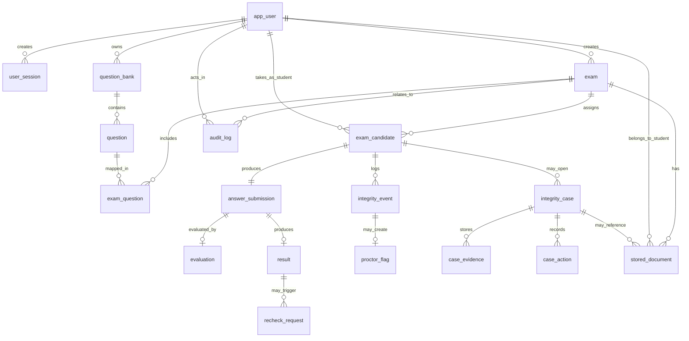

# Database ER Diagram and Schema Overview

This document summarizes the logical PostgreSQL schema used in the Exam Integrity System.

## 1. Main Database Design Goals
- maintain role-based user access
- support exam authoring and student assignment
- securely store answer submissions
- preserve suspicious activity logs and case workflow
- support evaluation, result publication, recheck, and auditability
- support cloud-stored document metadata for reports and evidence

## 2. Main Enumerated Types
- `user_role`
- `exam_status`
- `submission_status`
- `integrity_event_type`
- `case_status`
- `decision_type`
- `result_status`
- `recheck_status`

## 3. Core Tables

### Identity and Access
- `app_user`
- `user_session`

### Exam Authoring
- `exam`
- `question_bank`
- `question`
- `exam_question`
- `exam_candidate`

### Submission and Evaluation
- `answer_submission`
- `evaluation`
- `result`
- `recheck_request`

### Integrity and Investigation
- `integrity_event`
- `proctor_flag`
- `integrity_case`
- `case_evidence`
- `case_action`

### Audit and Reporting
- `audit_log`
- `stored_document`

## 4. Table Purpose Summary

| Table | Purpose |
|---|---|
| `app_user` | Stores admins, students, proctors, evaluators, auditors, and their login metadata |
| `user_session` | Tracks login/session tokens and device/IP related session info |
| `exam` | Stores exam master details such as schedule, duration, status, and integrity threshold |
| `question_bank` | Logical grouping for authored questions |
| `question` | Stores question text, options, answer key, and marks |
| `exam_question` | Maps questions to exams with order and marks override |
| `exam_candidate` | Maps assigned students to an exam attempt |
| `answer_submission` | Stores autosaved and final answers, timestamps, and hash verification data |
| `integrity_event` | Stores suspicious activities like tab switches and IP changes |
| `proctor_flag` | Stores explicit proctor-flagged records |
| `integrity_case` | Stores cheating/investigation case state per student attempt |
| `case_evidence` | Stores evidence references attached to a case |
| `case_action` | Stores case workflow actions like case opened and decision recorded |
| `evaluation` | Stores evaluator marks and feedback |
| `result` | Stores final result state, integrity score, and publish status |
| `recheck_request` | Stores post-result recheck requests |
| `audit_log` | Stores major system actions for traceability |
| `stored_document` | Stores S3 metadata for `result_report` and `integrity_evidence` |

## 5. ER Diagram

## 6. Relationship Notes

### User to Role Behavior
- `app_user.role` distinguishes `admin`, `student`, `proctor`, `evaluator`, `auditor`, and `instructor`.
- One physical user table supports all role types.

### Exam Assignment Model
- `exam_candidate` is the bridge between `exam` and student users.
- It also stores attempt state, timings, and suspicion score.

### Submission Security
- `answer_submission` stores current and final answers.
- Final submission hash is verified later for tamper detection.

### Integrity Workflow
- `integrity_event` stores raw suspicious events.
- `integrity_case` stores the investigation state.
- `case_evidence` and `case_action` preserve supporting records and workflow history.

### Result Lifecycle
- `evaluation` stores marking details.
- `result` stores publishable exam outcome.
- `recheck_request` supports post-publication review.

### Cloud Document Layer
- `stored_document` links DB records to S3 objects.
- Only these document types are currently allowed:
  - `result_report`
  - `integrity_evidence`

## 7. Important Views / Derived Integrity Summary
The project also uses derived integrity summary logic so that exam, evaluator, proctor, and auditor pages can quickly read:
- current integrity score
- latest case status
- submission hash verification state

This keeps dashboards simpler without duplicating core data.

## 8. Practical Schema Walkthrough
If one student takes one exam:
1. student is stored in `app_user`
2. assignment is stored in `exam_candidate`
3. answers are stored in `answer_submission`
4. suspicious actions go into `integrity_event`
5. proctor opens `integrity_case` if needed
6. evaluator adds `evaluation`
7. final academic/integrity outcome is stored in `result`
8. audit actions go into `audit_log`
9. generated report metadata goes into `stored_document`

## 9. Presentation Summary
The schema is centered around `exam_candidate`, because that single record connects:
- the student
- the exam
- the attempt
- the submission
- the suspicious activity trail
- the case workflow
- the final result
