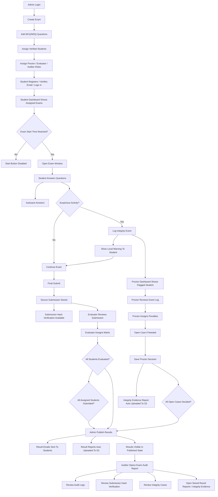
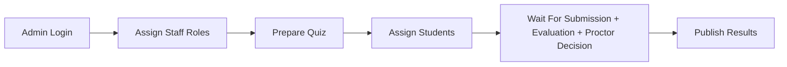
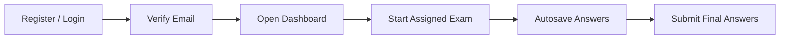
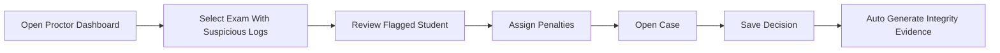
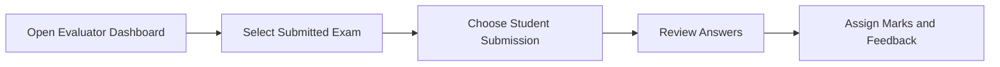
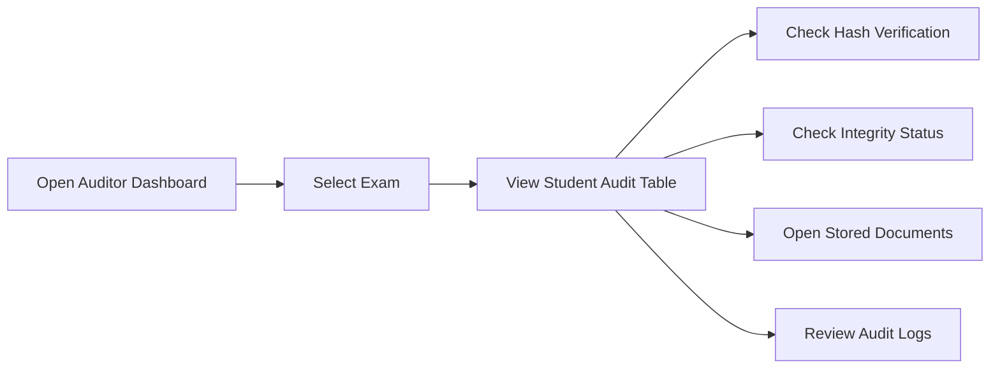

# System Flow Overview

This document provides a whole-project flow for explanation and presentation.

## 1. High-Level Idea
The system works as a pipeline:

1. admin prepares the exam
2. student takes the exam
3. suspicious actions are logged if they happen
4. evaluator marks submissions
5. proctor reviews suspicious cases
6. admin publishes results
7. auditor reviews final evidence and logs

## 2. End-to-End Flow Diagram

## 3. Role-Wise Flow

### Admin Flow

### Student Flow

### Proctor Flow

### Evaluator Flow

### Auditor Flow

## 4. Data Flow Summary
- frontend sends role-based requests to backend REST APIs
- backend stores transactional data in Neon Postgres
- backend writes suspicious events, case actions, and audit logs into DB
- backend sends emails through SMTP
- backend uploads result and integrity reports to S3
- auditor accesses stored document metadata from DB and opens signed S3 URLs

## 5. Security / Integrity Flow
- student final answers are stored securely
- submission hash verification supports tamper detection
- suspicious activities are logged only when events actually occur
- proctor assigns penalties manually instead of auto-punishment
- result publication is blocked until investigation decisions are completed

## 6. Presentation Summary
This system is not only an exam portal. It is a controlled exam lifecycle platform with:
- controlled access
- secure submission
- integrity event tracking
- investigation workflow
- evaluator marking
- gated result publication
- audit-ready reporting
