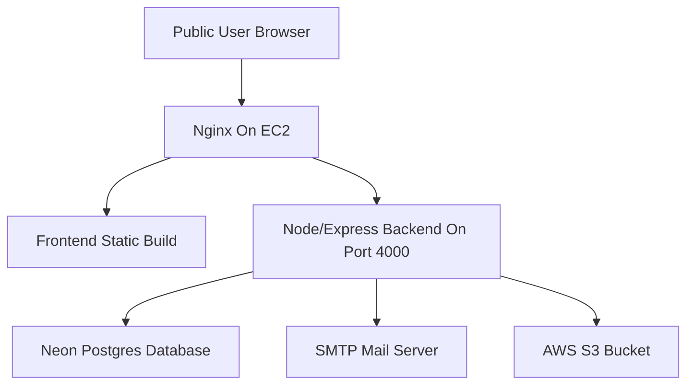
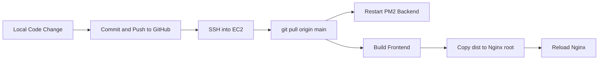

# AWS EC2 and S3 Setup Guide Used in This Project

This document explains what was installed, how it was configured, and how AWS is used in the Exam Integrity System.

## 1. AWS Components Used

### EC2
Used for:
- hosting backend service
- serving frontend to the public
- acting as the runtime server for the whole application

### S3
Used for:
- storing `result_report` files
- storing `integrity_evidence` files

Important note:
- S3 is not used for raw answer text storage
- the application database still remains Neon Postgres
- S3 only stores generated reports and evidence documents

## 2. Deployment Architecture



## 3. EC2 Setup Done

### Instance Purpose
One EC2 Ubuntu instance is used to host the full application.

### Main Software Installed on EC2
- Node.js and npm
- PM2
- Nginx
- Git
- AWS CLI

### Why Each Was Needed
- `Node.js`: run backend and build frontend
- `PM2`: keep backend process alive after logout/reboot
- `Nginx`: serve frontend and reverse proxy API traffic
- `Git`: pull project code from GitHub
- `AWS CLI`: test S3 and IAM integration directly from the server

## 4. IAM Role Setup for EC2
An IAM role was attached to the EC2 instance so the backend could access S3 without storing AWS access keys inside the project.

Typical process followed:
1. create IAM role
2. choose trusted entity type as `AWS service`
3. select use case `EC2`
4. attach S3 permissions policy
5. attach the role to the EC2 instance

Why this is good:
- no AWS secret keys hardcoded in code
- safer and easier for server-side S3 access

## 5. S3 Bucket Setup
An S3 bucket was created for the project to store generated documents.

Used for:
- exam result reports
- integrity evidence reports

Backend stores:
- actual file in S3
- metadata in `stored_document` table in Neon

Metadata includes:
- exam id
- student id
- case id if applicable
- document type
- original file name
- S3 object key

## 6. Backend Environment Configuration
The backend uses environment variables like:

```env
DATABASE_URL=...
FRONTEND_URL=http://your-frontend-host
SMTP_HOST=...
SMTP_PORT=587
SMTP_USER=...
SMTP_PASS=...
SMTP_FROM=...
AWS_REGION=your-region
S3_BUCKET=your-bucket-name
MAX_UPLOAD_SIZE_BYTES=10485760
```

Meaning:
- `AWS_REGION`: region of the S3 bucket
- `S3_BUCKET`: bucket where generated documents are stored
- `MAX_UPLOAD_SIZE_BYTES`: upload size limit for document APIs

## 7. Backend S3 Integration Logic
The backend uses AWS SDK and stores documents through server-side APIs.

Current allowed document types:
- `result_report`
- `integrity_evidence`

The main S3 flow is:
1. backend generates report content
2. backend uploads file buffer to S3
3. backend stores metadata in `stored_document`
4. auditor later requests a signed access URL
5. backend returns a signed S3 URL
6. browser opens the file securely

## 8. Automatic S3 Usage in This Project

### Result Report Upload
Triggered when:
- admin publishes results

Behavior:
- one result report is generated per student for that exam
- file is uploaded to S3 automatically
- DB metadata is inserted automatically

### Integrity Evidence Upload
Triggered when:
- proctor saves final case decision

Behavior:
- one integrity evidence report is generated for the case
- file is uploaded to S3 automatically
- DB metadata is inserted automatically
- case evidence reference is also updated

## 9. EC2 Runtime Configuration

### Backend
- backend runs under PM2
- Express app listens on port `4000`

Example style:
```bash
pm2 start src/server.js --name exam-integrity-backend
pm2 restart exam-integrity-backend
pm2 logs exam-integrity-backend
```

### Frontend
- frontend is built using Vite
- build output is copied to Nginx web root

Example style:
```bash
npm run build
sudo rsync -av --delete dist/ /var/www/exam-integrity/
sudo systemctl reload nginx
```

### Nginx
Nginx responsibilities:
- serve the frontend static files
- proxy backend requests such as `/api/...`
- expose the site through the EC2 public IP or domain

## 10. Deployment Update Flow
Whenever new code is pushed:



## 11. Commands Typically Used During Deployment

```bash
cd /home/ubuntu/ExamIntegrationProject
git pull origin main

cd /home/ubuntu/ExamIntegrationProject/backend
npm install
pm2 restart exam-integrity-backend

cd /home/ubuntu/ExamIntegrationProject/frontend
npm install
npm run build
sudo rsync -av --delete dist/ /var/www/exam-integrity/
sudo systemctl reload nginx
```

## 12. Why AWS Is Useful Here

### Why EC2
- full control over deployment
- free-tier friendly for demos
- can host both frontend and backend together

### Why S3
- durable storage for generated reports
- cleaner than storing report files directly on EC2 disk
- supports secure signed URLs
- fits well with audit and evidence access

## 13. Presentation Summary
In this project:
- EC2 hosts and runs the application
- Neon stores relational exam and integrity data
- S3 stores generated result and integrity report files
- Nginx + PM2 make the deployment usable for public access
